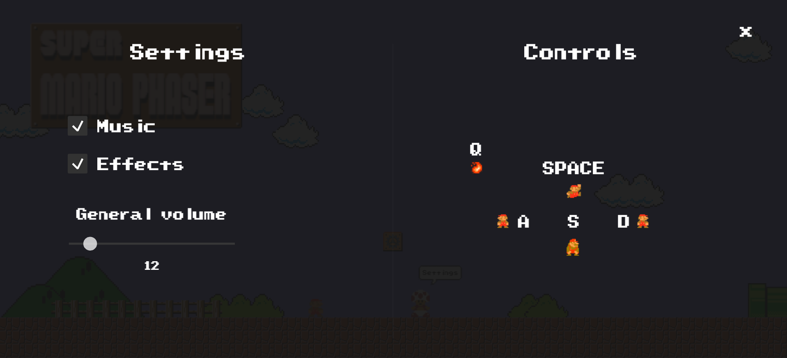

# **Super Mario Phaser**

Super Mario Phaser is a recreation of the classic Super Mario Bros game using the Phaser framework. This project aims to bring the nostalgic experience of playing the iconic platformer to modern web browsers. One exciting feature of this game is the random level generation, which ensures that each playthrough offers a unique and challenging experience.

## **Table of Contents**

- [Demo](#Demo)
- [Controls](#Controls)
- [Contributing](#Contributing)
- [License](#License)

### Demo

A live demo of the game can be accessed at [https://decapapi.github.io/Super-Mario-Phaser/](https://decapapi.github.io/Super-Mario-Phaser/).

Some screenshots of the game:

### Controls

Controls are fully customizable, however default controls are:

**Jump:** SPACE

**Move Left:** A

**Move Right:** D

**Crouch:** S

**Fire:** Q

### Contributing

Contributions are welcome! If you find any issues or have suggestions for improvements, please open an issue or submit a pull request. Make sure to adhere to the existing code style and follow the established guidelines.
